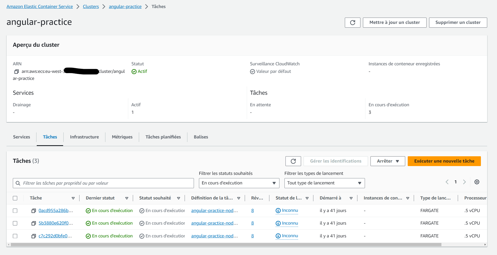
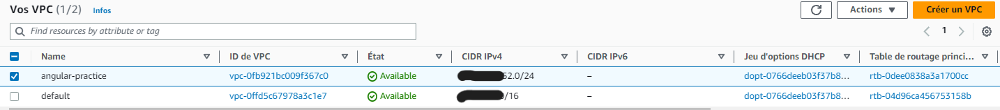

# N'EST PLUS DEPLOYE. 100€/MOIS POUR UN SITE DE DEMO NON UTILISE N'ETAIT PAS TENABLE

### Repo nodeJs qui va avec angular practice

Déployé manuellement via Docker avec le CLI sur Aws ECS Fargate
Serverless !== simplicité ! Ce n'est pas du tout aussi simple que leurs lambdas si on veut bien faire.

 'angular-practice-node-backend'")
